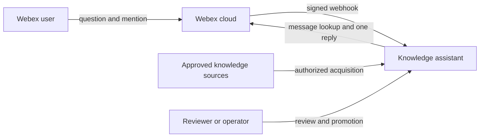
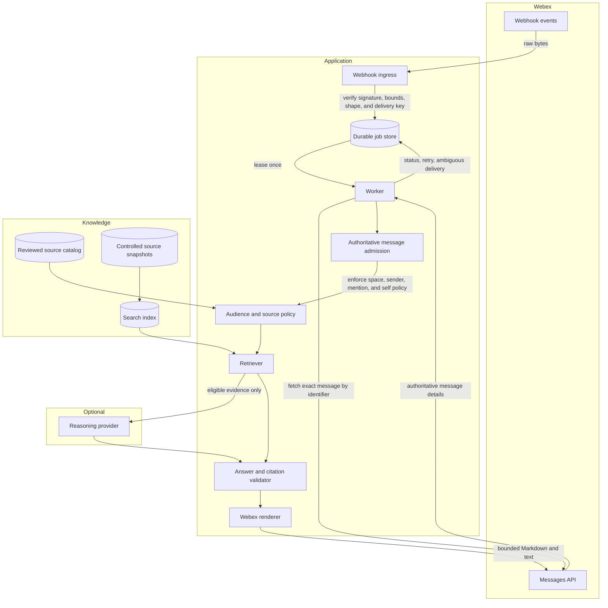
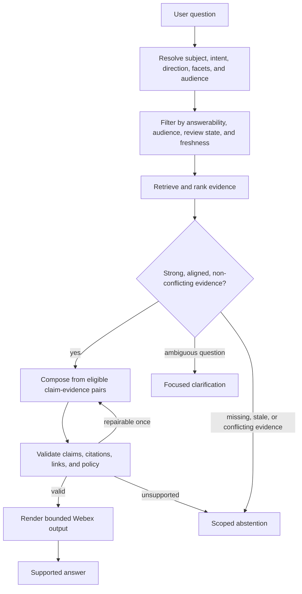

# Architecture

These views explain the same assistant at four levels: system context, runtime components, retrieval logic, and data placement. They are reference designs; a project may simplify them for a local proof or expand them for a hosted service.

## Level 1: system context

The assistant is the policy boundary. Membership in a space or possession of a document does not by itself make a message or source eligible for answering.

## Level 2: hosted runtime

Webhook ingestion returns success only after the signed delivery is durably recorded. Exact message admission occurs after the worker fetches authoritative details. Network calls occur outside database locks. Posting has a separate idempotency boundary because a lost connection after a message-create request can leave the outcome unknown.

## Level 3: retrieval-augmented generation logic

Conversation context may help resolve references such as “that feature,” but it never becomes factual evidence. An optional provider may classify or phrase an answer; deterministic eligibility and citation policy remain authoritative.

## Level 4: data placement and retention

| Data | Recommended home | Key control |
|---|---|---|
| Source snapshots | Controlled object storage | Authorization, checksum, retention, deletion |
| Normalized records and review state | Durable relational store | Provenance, promotion history, supersession |
| Search representation | Rebuildable index | Contains only approved, redacted fields |
| Accepted jobs and delivery state | Durable job store | Deduplication, leasing, bounded retries |
| Conversation context | Short-lived store | Minimum fields, age limit, turn limit |
| Secrets | Hosting secret mechanism | Never committed, logged, or placed in fixtures |
| Operational telemetry | Monitoring system | Safe reason codes and counts; no message bodies |

The application repository holds code, schemas, policy definitions, synthetic fixtures, and deployment instructions. It does not hold production source content, credentials, message exports, runtime databases, or logs.

## Local proof versus hosted service

A local proof may combine ingress and processing and use synthetic fixtures. Label that state accurately. A hosted service needs durable shared state, current migrations, owned HTTPS ingress, injected secrets, worker monitoring, rollback, and a reconciled Webex subscription.

Track these milestones separately: local validation, package build, repository publication, infrastructure readiness, source activation, webhook reconciliation, and authorized end-to-end delivery.
